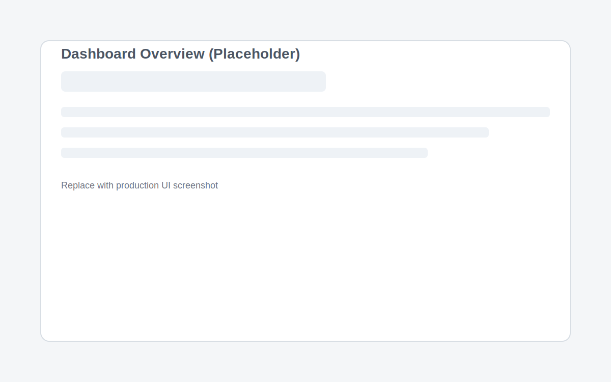
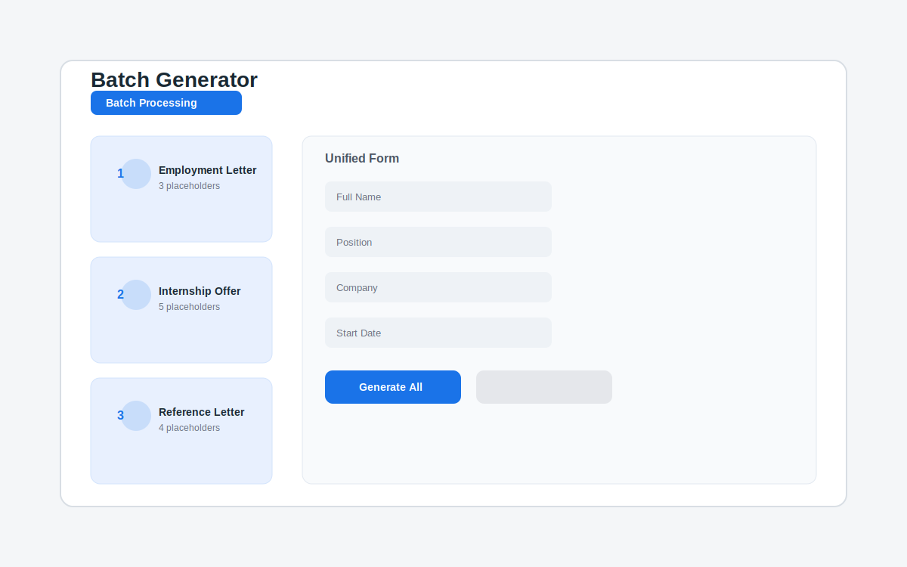

# MyTypist

MyTypist is a modern SaaS platform that turns document creation into a fast, automated, and reliable workflow for teams and professionals.

## Problem Statement
Document-heavy teams waste time on repetitive typing, inconsistent formatting, and error-prone manual updates across templates, reports, and client deliverables.

## Solution Overview
MyTypist centralizes document workflows and automates the repetitive steps so users can generate accurate, brand-consistent documents in minutes instead of hours.

## Features
- **Smart document generation** to reduce manual typing and eliminate copy/paste errors.
- **Reusable templates** that keep every output consistent with your brand.
- **Workflow automation** that accelerates approvals, revisions, and handoffs.
- **Secure collaboration** so teams can work together without version chaos.
- **Audit-ready history** to maintain compliance and track document changes.

## Use Cases
- Operations teams producing recurring reports and client deliverables.
- Legal and compliance teams assembling standardized documents quickly.
- HR and finance teams generating onboarding and policy materials.
- Agencies managing high-volume proposals and statements of work.

## Screenshots
> Replace these placeholders with real UI images when available.

## Tech Overview
- **Backend:** PHP, Laravel (private repository)
- **Frontend:** JavaScript, modern SPA framework (private repository)
- **Infrastructure:** Cloud-hosted, scalable services

## Project Structure
This public repository is a product hub only. Application code lives in private repositories.

- **Public repo (this repo):** Product documentation and branding assets
- **Frontend repo (private):** User interface and client experience
- **Backend repo (private):** APIs, workflows, and business logic

## Architecture Overview
MyTypist is split into independent services to keep product documentation public while protecting the application codebase:

- **Frontend (private repo):** Delivers the web experience to end users
- **Backend (private repo):** Powers automation, data processing, and integrations
- **Public repo (this repo):** Product narrative, roadmap, and public-facing resources

## Roadmap
- Advanced template intelligence for complex documents
- Role-based workflow approvals and audit controls
- Expanded integrations with CRM and storage providers
- Global scaling improvements for multi-region performance

## Links
- **Live application:** https://mytypist.com (placeholder)
- **Frontend repository:** Private
- **Backend repository:** Private

---

MyTypist is built for teams that want faster document workflows without sacrificing accuracy or compliance.
<!-- AI-Verified: 2026-05-26 -->
